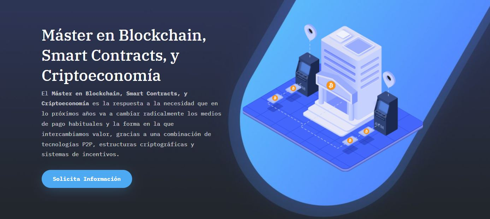

# **Prueba de Recuperación**

_______________________________________

## PROGRAMA INFORMATION TECHNOLOGY

### A. BLOQUE 1: “MÁQUINAS VIRTUALES Y LINUX” 
- Instalación de una máquina virtual con Ubuntu Linux mediante Virtual Box.
- Uso de los principales comandos sobre la consola de Linux.

### B. BLOQUE 2: “GIT, GITHUB Y MARKDOWN”
- Descarga, instalación, configuración y uso de Git.
- Creación, configuración y uso de una cuenta en GitHub.
- Uso de ficheros Markdown con toda su sintaxis.

### C. BLOQUE 3: “EL MODELO RELACIONAL Y SQL”
- Adquisición de los conceptos básicos del modelo relacional.
- Uso de los principales comandos del lenguaje SQL.

### D. BLOQUE 4: “REDES”
- Adquisición de los conceptos básicos del modelo OSI y del modelo TCP/IP, entre ellos conocer la diferencia entre UDP y TCP.
- Adquisición de otros conceptos relativos a redes.

### E. BLOQUE 5: “LA WEB”
- Uso de formatos de intercambio de datos para la web: XML y JSON.
- Uso de tecnologías relacionadas con la creación de un sitio web: HTML y CSS.

### F. BLOQUE 6: “JAVASCRIPT”
- Adquisición de los conceptos básicos de JavaScript.
- Uso de JavaScript para hacer peticiones REST.

### G. BLOQUE 7: “COMPUTACIÓN”
- Adquisición del concepto de complejidad computacional, conociendo las distintas clases de complejidad que existen y comprendiendo sus diferencias.
- Adquisición del concepto de estructura de datos, conociendo las distintas estructuras de datos existentes y comprendiendo sus diferencias.
- Adquisición de los conceptos básicos de la teoría de grafos, conociendo los distintos tipos de grafos existentes, y las distintas aplicaciones prácticas del estudio de dicha rama de la ciencia.

### ANEXO: REPOSITORIOS DE COMPAÑEROS

| **Nombre**             | **GITHUB**                        |
|--------------------|-------------------------------|
| Andrés Fondevila   | https://github.com/andresuah  |
| Adolfo Onrubia     | https://github.com/Binomi0    |
| Joseph Reyes       | https://github.com/jossjack   |
| Leilane Almeida    | https://github.com/leilane13  |
| Dario De La Hoz    | https://github.com/dariohoz   |
| Eneko Lakasta      | https://github.com/enekid     |
| Maximiliano Zapata | https://github.com/maxzapata/ |
| Mauro Perna        | https://github.com/MauroPerna |
| Daniel Molina      | https://github.com/dmolinac   |

# **[Master Blockchain, Smart Contract y Criptoeconomía](https://masterethereum.com/)** - **[Universidad de Alcalá de Henares](https://uah.es/es/)**

